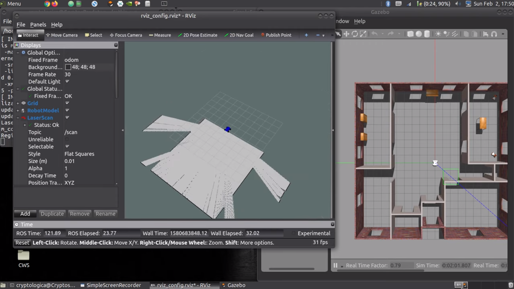

# RSD_004_MapMyWorld
This repo is my submission to Udacity's Robotic Software Developer Project 004, entitled "Map My World".

In this project, we will create a 2D occupancy grid and 3D octomap from our simulated environment using the RTAB-Map package, use Adaptive Monte Carlo Localization (AMCL) to localize the robot within the environment as we navigate via the TeleOp Twist Keyboard package.

The project must adhere to the [Project Rubric](https://review.udacity.com/#!/rubrics/2352/view)

 
